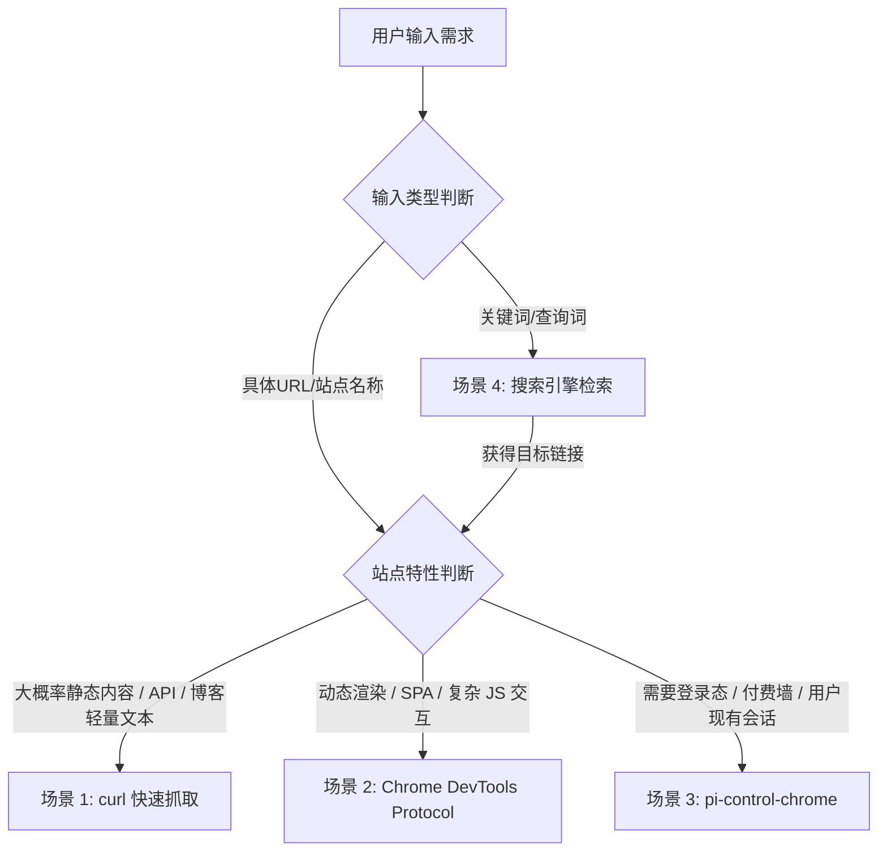

# Web Usage 技能规范

本 Skill 规范了在面对不同类型的 Web 检索与浏览需求时的工具选择路由与执行标准。

---

## 路由决策树



---

## 详细使用场景与操作规范

### 1. 静态网页抓取 (curl)
**适用条件**：
- 用户给出了明确的 URL。
- 目标为轻量博客、文档页、静态 HTML、REST/JSON API、Raw 数据等无需复杂 JavaScript 渲染的页面。

**执行方式**：
- 使用命令行工具 `curl` 配合 `grep`、`jq` 或文本处理工具快速提取。
- 示例：
  ```bash
  curl -sL "https://example.com/post.html"
  curl -s "https://api.example.com/data" | jq .
  ```

---

### 2. 动态网站 / SPA 交互 (CDP - Chrome DevTools Protocol) 优先使用！！！
**适用条件**：
- 用户给出了站点名称（如 Hacker News、Twitter、Reddit 等动态站点）。
- 网页内容重度依赖客户端 JavaScript 渲染、单页应用（SPA）、需要动态滚动或执行脚本解析 DOM。

**执行方式**：
- 使用 `chrome_devtools_*` 系列工具（如 `chrome_devtools_navigate`, `chrome_devtools_evaluate`, `chrome_devtools_screenshot`）。
- 示例流程：
  1. 页面导航：
     `chrome_devtools_navigate(url="https://news.ycombinator.com")`
  2. 提取/执行 JavaScript：
     `chrome_devtools_evaluate(expression="document.body.innerText")` 或精细提取 DOM 节点。

---

### 3. 带认证/登录态/付费墙站点 (pi-control-chrome)
**适用条件**：
- 页面需要用户身份凭据、SSO 登录、Cookie 保持。
- 目标包含付费墙（Paywall）限制、企业内网系统或需要借助用户本地现有 Chrome Profile 的登录状态。

**执行方式**：
- 结合 `pi-control-chrome` 扩展及本地 Bridge 控制用户的真实 Chrome 实例，复用当前已登录的 Profile 与会话。

---

### 4. 开放式关键词搜索 (web_search + 动态路由)
**适用条件**：
- 用户未提供直接 URL 或具体知名站点，仅提供查询关键词或模糊描述。

**执行方式**：
1. **搜索阶段**：
   - 优先调用 `web_search`（根据主题选择 `general` / `news` / `finance`）获取候选 URL 列表。
2. **路由阶段**：
   - 评估检索到的目标 URL：
     - 若为纯文档/静态文章 $\rightarrow$ 转入 **场景 1 (curl)** 或直接阅读。
     - 若为动态内容/交互式站点 $\rightarrow$ 转入 **场景 2 (CDP)**。
     - 若命中受限/付费/需登录页面 $\rightarrow$ 转入 **场景 3 (pi-control-chrome)**。
